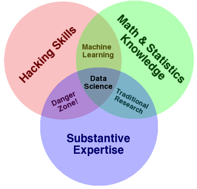
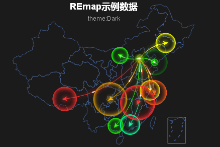
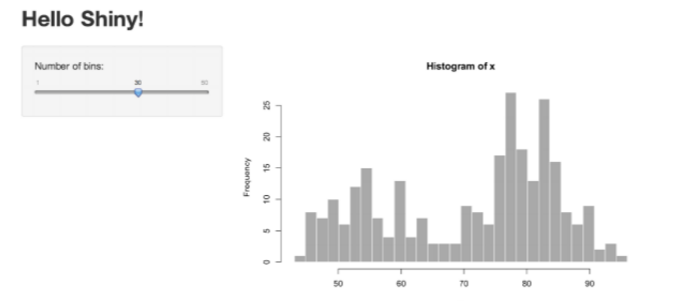

```{r setup, include=FALSE}
knitr::opts_chunk$set(echo = TRUE)
```

## 数据科学与大数据可视化

### 什么是数据科学


数据科学，实际上就是对数据提取，分析，理解，描述，预测的一门学科，提出的时间是2008年，乍一看来数据科学其实很像统计学，实际上，数据科学应当是统计与计算机的交叉学科.



谷歌首席经济学家Hal Varian在2009年说，下一个十年最有吸引力的工作就是统计学家。能获取并处理数据，从中得到有用信息并能图形化，并使人们得以理解，这将是非常重要的技能。在此处他所称的“统计学家”，实际上是能够提取大数据集的信息，然后展现给非数据专家的那些人，我们也可称之为数据极客（Data Geek）或是数据科学家(Data Scientists)。


### 数据科学家需要的能力
1. 计算机能力：数据的获取和整理
数据整理。任何数据分析项目的第一步是数据整理，对应着数据获取、清洗、格式转换等工作，使之成为可用数据。现在有各种各样的数据格式：数字、表格、Web网页、文本，甚至包括语音和视频。在处理凌乱的原始数据时，脚本语言（例如Perl和Python）是必不可少的。
大规模数据。传统的关系型数据库在大规模数据条件下已经不在有效。为了有效地存储庞大的数据集，我们看到的数据库出现的新品种。这些通常被称为非关系数据库，例如谷歌的BigTable和Amazon的Dynamo，它们有非常灵活的架构设计，分布在多个节点，以提供“最终一致性”。
存储数据只是数据平台建设的一部分。在目前的大规模数据集计算问题上，谷歌推广MapReduce方法，基本上它是利用非常庞大的计算集群进行分布计算。最流行的MapReduce开源实现方法就是Hadoop。Hadoop使“敏捷”数据分析成为可能。在软件开发中，“敏捷”意味着更快的产品周期，开发商和消费者之间更密切的互动。传统的数据分析需要极长的周转时间。它可能要几个小时、甚至几天才能完成。但是在Hadoop帮助下可以很容易地建立集群，以执行大规模数据集的迅速计算。更快的计算速度使你更容易地测试不同的假设，不同的数据集和不同的算法。

2. 数学和统计学能力：数据的挖掘
机器学习是数据科学家的另一项必不可少的工具。目前有许多机器学习库可以利用：在Python中有PyBrain，在Java中有WEKA，谷歌刚刚宣布了他们的Prediction API，使其机器学习算法得以公开使用。Stanford的机器学习课程，是计算机科学中最流行的课程之一，推荐学习。
虽然在这里没有强调传统的统计模型在数据分析中的重要作用，但是统计是“数据科学的语法”。它是至关重要的。数据科学不只是获取数据然后来猜测其意义，它也包含了假设检验，确保你的数据结论是有效的。统计已成为一项基本技能。它并没有被机器学习或商业智能所取代。
虽然有许多商业统计软件包，但开源R语言是一个不可或缺的工具。虽然R是一个奇怪的语言，但它为大多数统计工作提供“一站式购物”。它还具有出色的绘图功能。 CRAN中包括了多种类型的数据解析器和分布式计算扩展。如果有一个单一的工具，能为统计工作提供了一个最终解决方案，那就是R语言。

3. 图形可视化：数据的提炼和展现
一张图片胜过千言万语，可视化是数据分析的初步探索工作，也是每个阶段的关键。[FlowingData](http://flowingdata.com/)博客是一个寻找创意可视化非常棒的地方。这个可视化[例子](http://flowingdata.com/2010/04/07/watching-the-growth-of-walmart-now-with-100-more-sams-club/)就是随着时间的推移，沃尔玛增长的动画。这就是数据可视化的艺术。


### 如何成为一名数据科学家


1. 扎实的理论功底（统计，数据挖掘的基础知识、模型）
2. 一门脚本编程语言（R/Python/Julia..）
3. 丰富的实战经验

对于学习的顺序问题，应当是：理论—编程—-实战的过程，一个循序渐进的安排会让自己效率大增。对于在校学生，最好的方式是课程中完成理论的学习，平时自学完成编程的学习，最后靠实践/实习来积累数据分析的实战经验。


John Hopkins大学提供了一整套的数据科学的在线课程，一共九门课，虽然这门课部分内容讲的不够深入，但不妨碍它成为一个很好的数据科学学习大纲：

数据科学家的工具箱 Data scientist’s tool-box
R语言编程 R programming
获取和清理是数据 Getting and cleaning data
探索性统计分析 Exploratory Data Analysis
可重复性研究 Reproducible Research
统计推断 Statistic Inference
回归模型 Rgression Model
实用机器学习 Practical machine learning
数据产品开发 developing data products


#### 数据科学家的工具箱Data scientist’s tool-box


Get an overview of the data, questions, and tools that data analysts and data scientists work with. This is the first course in the Johns Hopkins Data Science Specialization.

DST这门课主要讲的是这个专项课程的大纲，另外就是一些基础的背景知识的介绍,包括：

- R/Rstudio的安装使用
- 其他课程的介绍
- Git版本控制工具

这里有一个比较重要的技能，就是git和Github的使用。Git一款自由和开源的分布式版本控制系统，用于敏捷高效地处理任何或小或大的项目。
Github是程序猿们的博客，简单的说，就是一个共享代码，或者管理项目代码的网站(博客)，在后续的大部分课程中，作业是需要用Git来上传到Github中的，而在现实的工作中，如果涉及到程序，代码的问题，Git也是一项必备的技能。


#### R语言编程 R programming


Learn how to program in R and how to use R for effective data analysis. This is the second course in the Johns Hopkins Data Science Specialization.


课程主要讲述一些基本的R语言编程方法：数据类型，导入数据，循环，向量化，debug，scroping Rule…


#### 获取和清理数据 Getting and cleaning data

Learn how to gather and clean data from a variety of sources. This is the third course in the Johns Hopkins Data Science Specialization.

对于一个实际的项目，最重要的是什么？

目的>数据>模型

为了解决这个问题，我们需要导入数据，数据有问题，需要做清理以保证数据适用于下一步的建模
Getting and cleaning data这门课所教授的就是数据收集和清理的过程，
数据的收集包括:

- 本地数据(.xlx,.csv,.txt)
- 网络数据(html，xml，jason,API)
- 数据库的数据(MySQL,HDF5)
- 数据的清理包括：
  - 处理异常值
  - 特征子集的选取
  - 正则化表达

这只是课程主要的一些项目，对于图像数据，音频数据的导入，数据的变形与整合等，都有提到，课程所包含的知识点很广，同时也相当实用.

#### 探索性统计分析 Exploratory Data Analysis

Learn the essential exploratory techniques for summarizing data. This is the fourth course in the Johns Hopkins Data Science Specialization.

Exploratory Data Analysis这门课主要讲怎么用R来画图，以完成探索性的分析过程，画图主要靠三个包：

- base包，最基础的
- lattice包画图，适用于大数据的
- ggplot2包，方法最全也是画出来最好看的

此外还会介绍一些经典的多元模型：层次聚类，Kmeans聚类，和主成分分析的方法
这门课要用git来传图片到Github什么的，而且对R的编程要求不低.


#### 可重复性研究 Reproducible Research

Learn the concepts and tools behind reporting modern data analyses in a reproducible manner. This is the fifth course in the Johns Hopkins Data Science Specialization.

对于一个研究，或者一个论文，别人检测你的结论是否正确等，应该怎么做呢？自己再手动编程一遍实在是复杂，一个比较现代的方法就是做一个可重复研究的文档，其中包含程序，结果，结论等.

这门课讲述了如何用RMarkdown做出一个网页以方便别人来对你的结果进行重现

其实客观的来说，如果你完全掌握了Yihui的knitr包，这门课剩下的部分是理工科中少见的文艺风了，各种对于研究的讨论，研究思路的发掘，讲述，相信对于培养一个数据科学的氛围来说，是相当的不错。


#### 统计推断（Statistic Inference）


Learn how to draw conclusions about populations or scientific truths from data. This is the sixth course in the Johns Hopkins Data Science Course Track.


其实，统计推断就是概率论与数理统计，统计学出身的话这门课应该不难学。

Statistic Inference从概率和随机变量讲起，一直讲到统计的检验的势，只花了四周，当然一些高深的统计知识不需要证明或者计算，只要你可以在R里面实现就可以了…

#### 回归模型 Rgression Model

Learn how to use regression models, the most important statistical analysis tool in the data scientist’s toolkit. This is the seventh course in the Johns Hopkins Data Science Specialization.

回归是统计历史上发展最完全，影响最深远，至今还有很大活力的一类模型，这也是John Hopkins为什么要用一整门课 Rgression Model,来叙述这一个模型了.最简单的回归就是用来描述变量之间的线性关系，或者可以看做量化相关性，之后一点点变复杂，从一元到多元，从iid的正态误差项到各种其他的情况。

所有的计算的过程都在R中完成，也包含了一些理论的证明过程.

包含知识点：

- 线性回归(一元/多元)
- 模型解释(系数，残差)
- 模型诊断(异方差，多重共线性..)
- GLM(包括Logistic回归，Poission回归等)


#### 实用机器学习 Practical machine learning

Learn the basic components of building and applying prediction functions with an emphasis on practical applications. This is the eighth course in the Johns Hopkins Data Science Specialization.

和回归模型的课程比起来，Practical machine learning这门课所包含的模型更多，回归模型的课程是为了告诉你对于一个模型应该怎样完整的学习它，而Practical machine learning 是为了尽可能多的为你介绍现代的一些数据挖掘模型,并深入浅出的传授整套机器学习的流程：

数据清洁—>划分训练集—>模型拟合—>模型评价,预测。

包含知识点：

- 模型的训练与检验
- 各种分类模型：分类树，随机森林，Bagging，GBM，正则化回归(lasso,Riddge)
- 模型诊断(异方差，多重共线性..)
- GLM(包括Logistic回归，Poission回归等)


#### 数据产品开发 developing data product

Learn the basics of creating data products using Shiny, R packages, and interactive graphics. This is the ninth course in the Johns Hopkins Data Science Specialization.

最后一门课应该是最炫的一门了，之前8门课说当做铺垫也不为过，最后的课程应该就是这3部分的内容：

- slidify
- shiny
- packages

slidify是Ramnathv写的一个基于markdown的包，不在R的镜像里面，需要用Devtool从github上安装，单纯的说，这个包就是用来做可重复实验的slide(ppt)而由于使用的是Markdown 语法，所以整个编写过程简化许多，是一个在R中很fashion的包

shiny是Rstudio开发的制作可交互网页的包，将R的函数转化为JS的代码，从而可以做出很多很酷的网页效果，细节请看(shiny.rstudio.com)

最后的packages是讲述了如何写一个自己的package，在学第一门课的时候应该是从未想到自己可以达到这样的水平吧，实际上package就是一些函数的合辑，如果你对自己的函数有信心，为什么不试试呢？


## 大数据可视化案例

### REmap

REmap是一个基于Echarts2 http://echarts.baidu.com 的一个R包.主要的目的是为广大数据玩家提供一个简便的,可交互的地图数据可视化工具.目前托管在github, https://github.com/lchiffon/REmap



使用如下步骤安装：
```
library(devtools)
install_github('lchiffon/REmap')
```
REmap目前更新到V0.3，提供百度迁徙，分级统计，百度地图，热力图等功能的实现。

提示:请使用Chrome或者Firefox来作为默认浏览器


#### 特性

使用Echarts2.0封包，地图绘制使用的是SVG图形
采用百度API来自动获取城市的经纬度数据
支持Windows！


#### 获取经纬度

获取经纬度的函数是基于BaiduAPI的一个获取地理位置的功能。这个函数不仅是REmap下的一个功能，实际上，你也可以用它来抓取城市经纬度数据：

### 基本函数:

`get_city_coord` 获取一个城市的经纬度
`get_geo_position` 获取一个城市向量的经纬度

```
library(REmap)
city_vec = c("北京","Shanghai","广州")
get_city_coord("Shanghai")
[1] 121.47865  31.21562
get_geo_position (city_vec)
        lon      lat     city
1  116.6212 40.06107     北京
2  121.4786 31.21562 Shanghai
3  113.3094 23.39237     广州
```
注：windows用户会看到city一列为utf-8编码，可以使用`get_geo_position(city_vec2)$city`查看列向量的信息。

## 绘制迁徙地图

绘制地图使用的是主函数remap

```
remap(mapdata, title = "", subtitle = "", 
      theme =get_theme("Dark"))
```

mapdata 一个数据框对象，第一列为出发地点，第二列为到达地点
title 标题
subtitle 副标题
theme 控制生成地图的颜色，具体将会在get_theme部分说明
```
set.seed(125)
origin = rep("北京",10)
destination = c('上海','广州','大连','南宁','南昌',
                '拉萨','长春','包头','重庆','常州')
dat = data.frame(origin,destination)
out = remap(dat,title = "REmap实例数据",subtitle = "theme:Dark")
plot(out)
```
[slides介绍](http://lchiffon.github.io/REmap/REmapExamples/Nanchang/?theme=sky#/slide-1)

### 其他有趣的可视化

该部分介绍了一些有意思的可视化内容, 除了散点, 条形图, 柱状图以外, 还有其他有意思的可视化.
[详细内容见](http://langdawei.com/reveal_slidify/slides/2016SH/#/slide-1)

## 数据可视化与数据产品

### shiny

 Shiny是一个R包，它让通过R语言建立互动网络应用（apps）变得更加简洁。  如果你尚未安装Shiny包，请新建一个R任务，并连接网络，在控制台执行
以下代码： 
```
install.packages("shiny")
```
Shiny包中内置了11个示例，详细地展现Shiny的基本特性。每一个示例都是一个独立的应用程序。  Hello Shiny示例根据R的faithful数据集绘制一个直方图，并且由可变数量的bins进行操控。用户可以通过滑动条更改bins的数量，应用会立刻对更改动作做出响应。你可以使用Hello Shiny来探索一个Shiny应用的结构,并且创造属于你的第一个应用程序。 
执行Hello Shiny，键入： 
```
library(Shiny)  
runExample(“01_hello”)
```




## HTML5课件实例


### slidify


[slidify](https://github.com/ramnathv/slidify)是款用Rmd生成精美slides的R包，作者是Ramnath Vaidyanathan。这个包并没有在CRAN的镜像上，而是托管在Github上，需要用以下方法安装:
(在运行之前需要保证安装了`devtools`,如果没有请跑下`install.packages('devtools')`)

```
library(devtools)
install_github("ramnathv/slidify")
install_github("ramnathv/slidifyLibraries")
```

#### 初始化
用`author`函数初始化一个幻灯片结构, 包括了各种需要引用的html文件, 全部构建在所声明的工作路径.

```{r eval=F}
library(slidify)
author('mydeck')
```


#### 制作

可以在RMarkdown中写自己的幻灯片, 用"---"来标明这是一页新的幻灯片. RMarkdown可以和Latex代码, R代码, 甚至是HTML混合使用, 来制作一个HTML5幻灯片.


#### 编译

使用以下代码编译这个幻灯片, 或者可以像Rmd文件一样点击Rstudio中的Knit按钮.
```{r eval = F}
slidify('index.Rmd')
```

### 发布

可以通过以下代码发布到github
```{r eval = F}
# publish to github
# create an empty repo on github. replace USER and REPO with your repo details
publish(user = USER, repo = REPO) 

# publish to rpubs
publish(title = 'My Deck', 'index.html', host = 'rpubs')
```

#### 具体使用

1. Mathjax
2. Layouts
3. Backgrounds
4. Widgets
5. Overlays
6. Metadata
7. Embeds

```
framework      : slide generation framework to use
theme          : theme to use for styling slide content
highlighter    : tool to use for syntax highlighting
hitheme        : style to use for syntax highlighting
mode           : selfcontained, standalone, draft
url            : paths to lib
widgets        : widgets to include
```


### xaringan

[xaringan](https://github.com/yihui/xaringan)是谢益辉编写的一个基于`remark.js`的R程序包, 也是用于制作HTML5的幻灯片, 与slidify相比, xaringan具有以下的优点:

- 设置相对简单得多
- 图片全屏显示(slidify中需要设置额外的layout)
- mathjax支持

基本安装:
```{r eval =F}
install.packages("xaringan")
```


- 从菜单 
`File -> New File -> R Markdown -> From Template -> Ninja Presentation (Simplified Chinese)` 
创建一个新文档;

- 点击 `Knit` 按钮编译文档；

### Rpres

[介绍](https://support.rstudio.com/hc/en-us/articles/200486468-Authoring-R-Presentations)

`File -> New File -> R Presentation` 
创建一个新文档;

#### Refs
- http://xccds1977.blogspot.sg/2011/11/data-science.html
- http://langdawei.com/2014/08/30/how-to.html