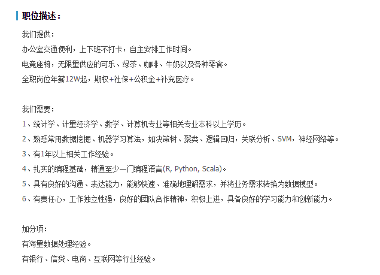
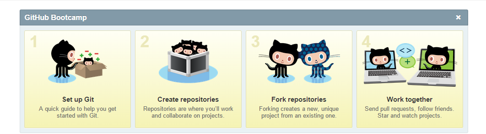

## Outlines

1. 数据科学
2. 可视化
3. slidify
4. xaringan/shiny

<style>
.slides article > strong{
    color:red;
}
</style>


---.segue .dark
## 数据科学与统计学

---
## 数据科学的定义

谷歌首席经济学家Hal Varian在2009年说，下一个十年最有吸引力的工作就是统计学家。能获取并处理数据，从中得到有用信息并能图形化，并使人们得以理解，这将是非常重要的技能。

- 在此处他所称的“统计学家”，实际上是能够提取大数据集的信息，然后展现给非数据专家的那些人，我们也可称之为数据极客（Data Geek）或是数据科学家(Data Scientists)。


---
## 数据科学家的JD




---
## 数据科学


---
## 统计学
统计学是在数据分析的基础上，自17世纪中叶产生并逐步发展起来的一门学科。 它是研究如何测定、收集、整理、归纳和分析反映数据资料，以便给出正确信息的科学。

>- 测定：试验设计
>- 收集：抽样调查
>- 整理：数据清理
>- 归纳：描述统计
>- 分析：统计推断，假设检验，数理统计，统计模型

---
## 技术栈
- 分析
  - R
  - Python/Spark
- 后端
  - SQL(MySQL/SQL Server/Hive/Oracle)
  - Shell &Git
  - Pyhton/Node
- 前端
  - HTML
  - JS(D3,Echarts,jQuery,...)

---
## 技术栈


---
## 理论储备
- 统计
  - 概率，随机变量，分布
  - 假设检验
  - 统计模型
- 机器学习
  - 有监督学习
  - 无监督学习

---
## 数据科学家的特质
- 数据敏感
- 好奇心
- story-teller
- 学习能力

---
## 数据科学做什么


---
## 数据科学的学习大纲
1. 总览(git,Rstudio)
2. R语言入门
3. 读取与清理数据
4. 数据可视化
5. 可重复性研究 
6. 统计推断 
7. 回归模型 
8. 机器学习 
9. 数据产品开发 

---
## 1总览
- 了解概念
- 学习Git， github
- Rstudio安装使用

>- 


---
## Git


- 优秀的版本控制工具
- 本地使用

```
# 声明需要添加的文件
git add -A
# 存档
git commit -am 'some infomation'
```
- 可用`git log`，`git reset`来恢复存档


---
## Github
- 分享，协作代码平台

```
## 下载repo
git clone http://github.com/lchiffon/wordcloud2
git pull
## 三板斧
git add -A
git commit -am 'some infomation'
git push
```



---
## R语言入门
- 查帮助
- packages使用
- 控制语句，函数，apply
- Play with swirl
```
install.packages("swirl")
swirl()
```

---
## 读取与清洗数据
- 传统数据: .xlsx, .txt, .csv
- 数据库: MySQL, SQLserver, mogoDB, HIVE, ...
- 其他程序的数据: Matlab, Stata, SAS
- 网页数据(爬虫): .json, .html, .xml
- 地理信息数据: .topojson, .geojson, .shp, .map


---
## 数据可视化
- 静态: ggplot2.org/doc 
- 动态: htmlwidgets

静态可视化适合用于探索型可视化，论文，书籍等展示形式

web可视化适合在网页，H5页面，App，产品中使用，更多用于展示型可视化

---
## 可重复研究
- `knitr`与`rmarkdown`
- 生成html, docx, pdf, slides, dashboard

---
## 统计推断
- 传统的概率论与数理统计课程， 学习统计相关的内容

## 回归分析
- 经典的回归分析
- logistic回归
- 各种异常情况的处理

## 机器学习
- 有监督学习
- 无监督学习

---
## 开发数据产品
- 开发端： package
- 产品端： shiny
- 报告端： slidify


---.segue .dark
## web可视化

---
## Topic
- [REmap](../2016SH/index.html)
- [其他可视化](../Nanchang/index.html)

---.segue .dark
## HTML5的幻灯片

---
## HTML5的幻灯片
- [slidify](../slidify)
- [xaringan](../xaringan/Untitled/Untitled.html)
- Rpres

---
## slidify与可视化
1. 保存并使用iframe
2. 在slidify中转为静态图片
3. xaringan中使用` eval=require('leafletCN')`

```
    <iframe data-src="html/pall.html" height="600px" width="800px"></iframe>
```

---
## Contact Me

- 邮箱：
  - dawei_lang@sina.cn
- 微博：
  - @郎大为Chiffon
